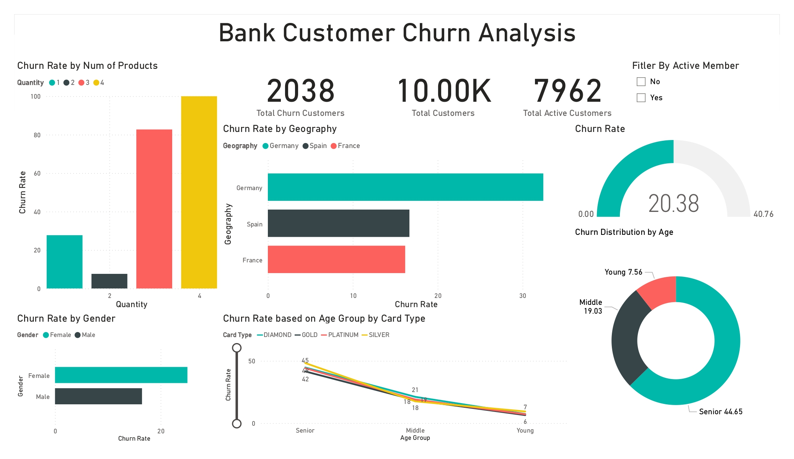

---

##  Dataset (columns excerpt)
`CreditScore, Geography, Gender, Age, Tenure, Balance, NumOfProducts, HasCrCard, IsActiveMember, EstimatedSalary, Exited, ...`  
Additional engineered fields: one-hot geographies & card types, `Gender_code`, `age_group`, etc.

---

## 1)  SQL: Cleaning & Feature Prep
File: `bank_churn_sql_eda_and_preprocessing.sql`

**Key steps**
- Dropped non-predictive identifiers (`RowNumber`, `CustomerID`, `Surname`).
- Encoded `Gender` → `Gender_code`.
- One-hot encoded `Geography` and `Card_Type`.
- Created `age_group` (Young/Middle/Senior).
- Null checks & quick EDA (churn rate by geography, gender, age group, products, activity).
- Exported cleaned table to `data/processed/Customer-Churn-Processed.csv`.

> **Note on leakage:** The `Complain` field had extremely high feature importance (~0.49 in RF) and acted like a proxy for churn. We **removed `Complain` ** for modeling to avoid leakage and get a realistic performance estimate.

---

## 2)  Power BI: Dashboards
File: `Bank_Customer_Dashboards.pbix` (2 pages)

### Page 1 — **Bank Customer Churn Analysis**
- KPIs: **Total Churn**, **Total Customers**, **Active Customers**, **Churn Rate**
- Visuals: Churn by Geography, Gender, Age Group, Num of Products, Activity Status
- Use to understand **who churns** and **where**.

### Page 2 — **Bank Customer Insights & Performance**
- KPIs: **Average Tenure**, **Average Satisfaction Score**, **Avg Num of Products**, **Active Customers**
- Visuals:
  - **Customer Age Distribution**
  - **Customer Count by Geography**
  - **Customer Gender Split**
  - **Card Type Distribution & Average Credit Score** 
- Slicers: Geography, Gender, Age Group, Card Type, Active Member
- Built with **Power Query** transformations for neat dimension fields.

_Screenshots_



---

## 3) Python ML: Modeling
Notebook: `Bank_Customer_Churn_Prediction.ipynb`

**Process**
- Loaded `data/processed/Customer-Churn-Processed.csv`
- Dropped leakage/non-predictive columns (e.g., `Complain`, raw text IDs).
- Split into **X, y** with `Exited` as target.
- **Scaling:** `StandardScaler` fit on **train only**, applied to `X_train` and `X_test` (tree models are scale-invariant but kept pipeline consistent).
- Trained 8 classifiers:
  - Logistic Regression (LR), KNN, SVC, Decision Tree (DTC),
  - Random Forest (RF), Gradient Boosting (GBC), XGBoost (XGB), AdaBoost (ADA)
- Metrics: **Accuracy** (primary), with hold-out test set.

**Results (after removing leakage)**
- Typical range on hold-out: **~0.80–0.87** accuracy  
- **Best** in this run: **Random Forest ~0.87** accuracy  
- Saved best model (optional): `models/bank_churn`

> Earlier near-99% accuracy was traced to **feature leakage** from `Complain`. After removing it, scores stabilized to realistic levels.

---

## 🚀 Reproduce Locally
```bash
# 1) Environment
pip install -r requirements.txt

# 2) (Optional) Recreate SQL preprocessing in MySQL
#    then export processed CSV to data/processed/

# 3) Run the notebook
jupyter notebook notebooks/Bank_Customer_Churn_Prediction.ipynb
